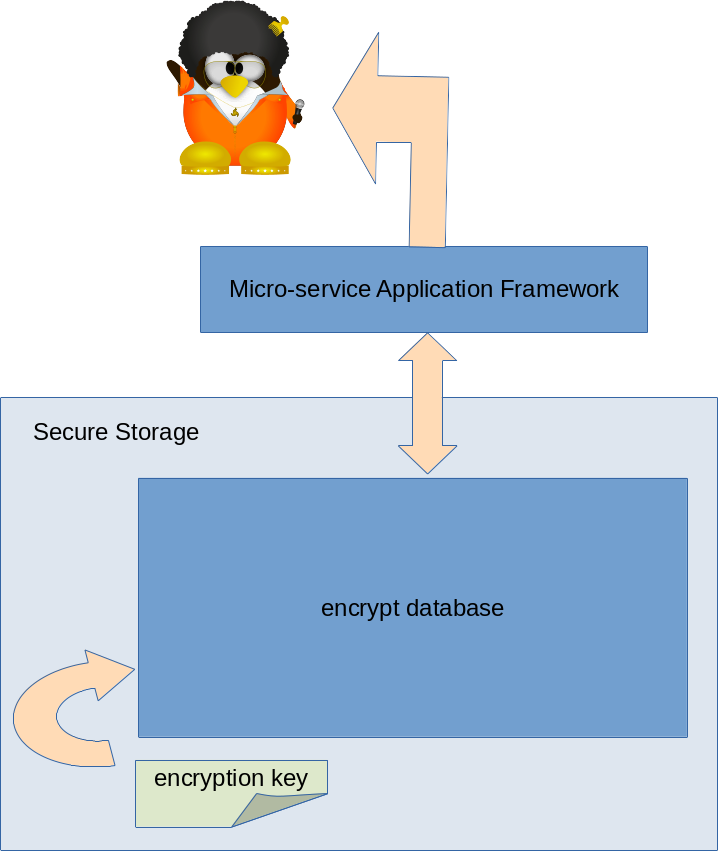
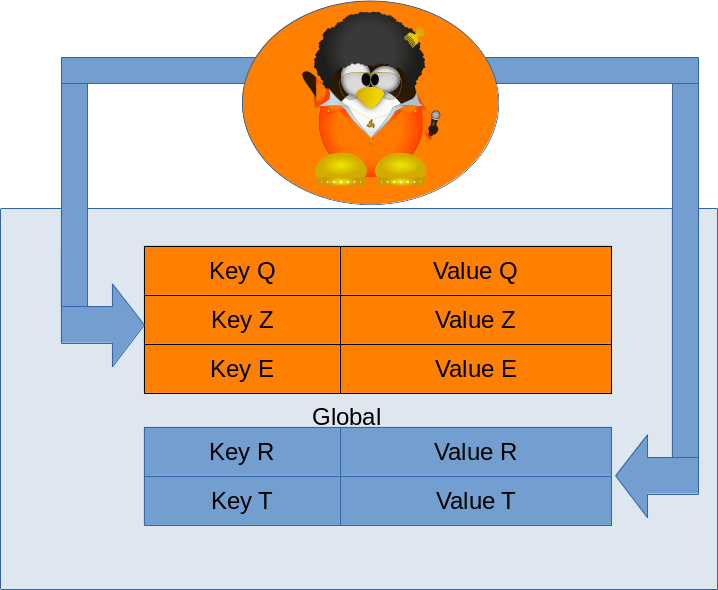
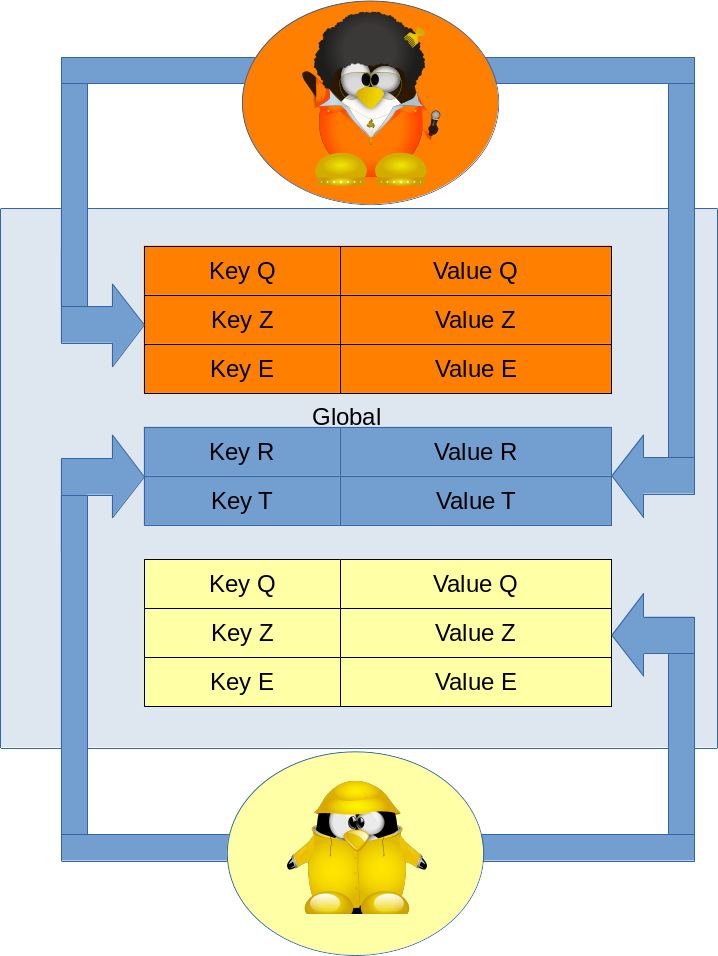
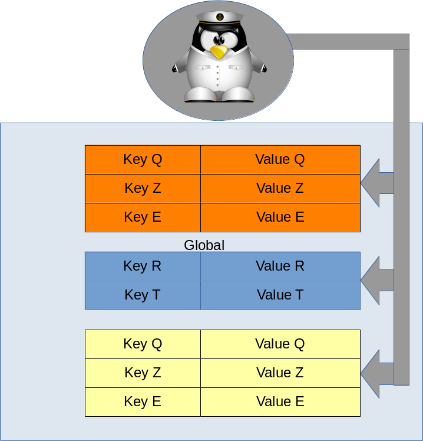

# Secure Storage binding for redpesk

## Architecture

The redpesk Secure Storage binding is base on the [legato.io](https://legato.io/) secure storage API.

* [secure storage](https://docs.legato.io/latest/c_secStore.html)
* [secure storage Admin](https://docs.legato.io/latest/c_secStoreAdmin.html)

The core of the secure storage is a an encrypted database.

The Secure Storage binding provides a secure API to access the encrypted database.

Every client application can store data in a key/value format in the data base, in a private section or in public section call "global".

So two client applications can only share key/value throw the "global" section.

Only an administrator can have access to the full secure storage area.

The Administration API is mostly disabled by default in Framework for security concerns.
